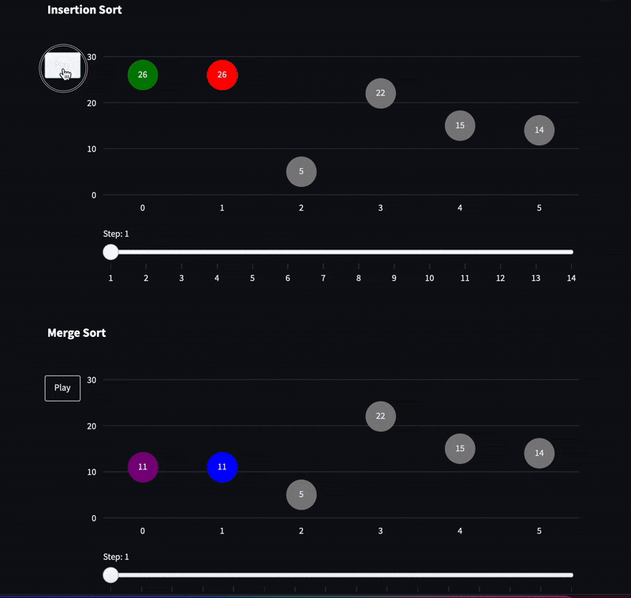

# Sorting Algorithm Visualizer

A Streamlit-based web app that visually compares **Insertion Sort** and **Merge Sort** step-by-step using animated scatter plot charts.

You can directly reach live demo with this link:  
[Insertion Sort vs Merge Sort](https://huggingface.co/spaces/gokaymeydan/sorting-algorithm-visualizer)



## Features

- Generates a random array for sorting
- Animated visualization of Insertion Sort and Merge Sort (vertically stacked)
- Highlights active elements and sorted regions
- Displays total number of sorting steps
- CLRS-based algorithm summaries (Introduction to Algorithms, 4th Edition)

## How to Run Locally

```bash
pip install -r requirements.txt
streamlit run app.py